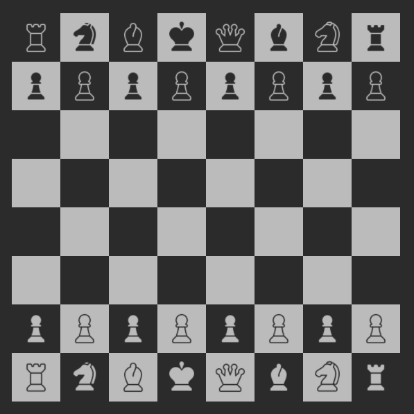

# activity4-chessboard-grid
Activity 4: Responsive Chessboard using CSS Grid
 - HTML
 - SCSS
 - JS

# All Contents  
- Responsive Chessboard (All Devices)
- Playable Game (Not Done)

# Screenshot Sample

# Grid Elements

